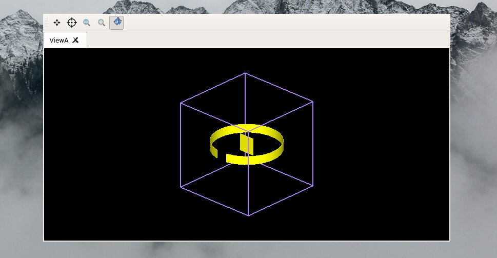

# What's Topas?

<div style="text-align: center;">
  <p style="text-align: justify;"> TOPAS is a Monte Carlo simulation software based on Geant4, designed for simulating particle interactions in materials. It is useful in medical physics, radiation protection, and nuclear science. TOPAS enables users to define geometries, materials, and particle types, offering tools for result analysis. Its user-friendly interface and scripting features make it accessible to researchers and practitioners..
  </p>
</div>

## Geometry 

```bash
########### WORLD ###########
### GUI (5. half leght) and air

s:Gr/ViewA/Type             = "OpenGL"
Ts/UseQt = "True"  # gui
#b:Gr/ViewA/IncludeAxes = "True"
d:Ge/World/HLX         = 1. m
d:Ge/World/HLY         = 1. m
d:Ge/World/HLZ         = 1. m
b:Ge/World/Invisible   = "False"
s:Ge/World/Material    = "Vacuum"
```

## Sources 

## Detectors 


## Rutherford experiment 
 
<p align="center">
  
</p>


## Chadwick's Discovery of The Neutron

In 1932, James Chadwick discovered the neutron by bombarding beryllium with alpha particles, releasing neutral radiation. Through momentum conservation, he determined these particles had a mass similar to protons. This discovery was vital for understanding atomic nuclei, as it confirmed the existence of neutrons. Chadwick received the Nobel Prize in 1935 for this groundbreaking work.


